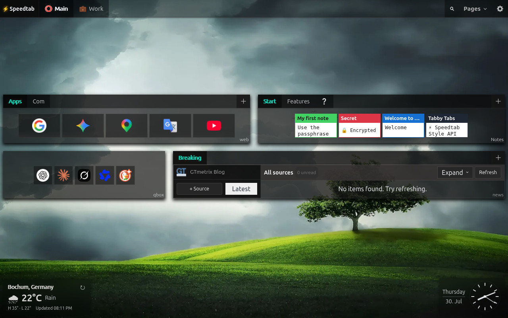
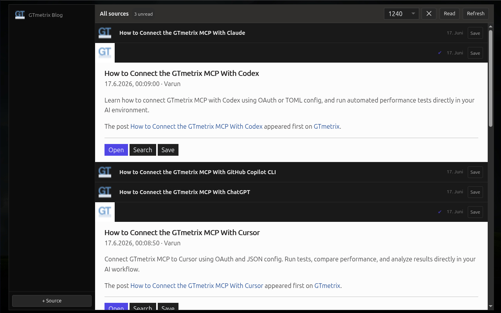
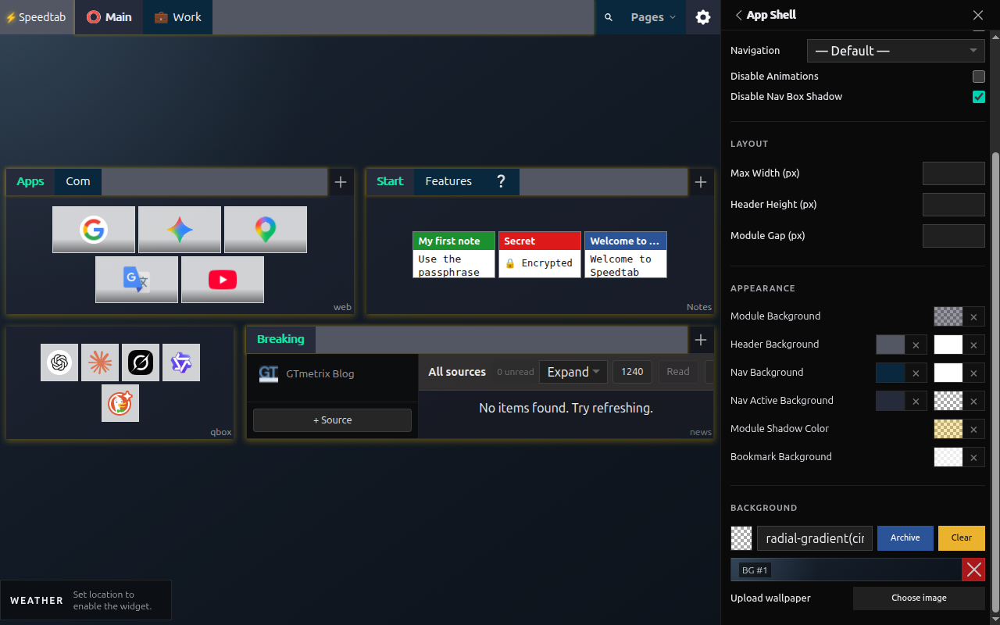
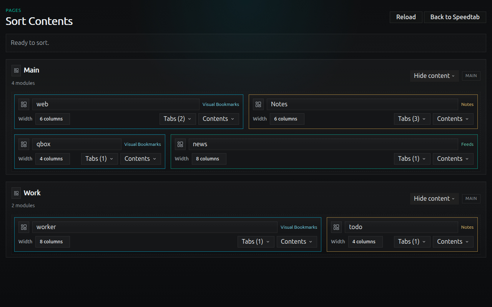

# Speedtab

Speedtab is a local-first Chrome new tab extension built as a fast Speed Dial and modular dashboard instead of a blank page or a slow cloud product.

It replaces the browser new tab page with three integrated building blocks:
- visual bookmarks
- RSS/Atom feeds
- typed notes, including client-side encrypted notes

Everything runs in the browser. There is no backend, no account, and no required cloud service.

Chrome Web Store: [Speedtab](https://chromewebstore.google.com/detail/speedtab/adkjbdepojalajhfkoobiedddlnoamff)

Current public version: `1.4.1`

## Highlights

- Local-first architecture with IndexedDB via Dexie
- Replaces the Chrome/Brave new tab page
- Rebuilt in `1.4.0` from a Vue-based UI to a lighter YaiJS/YEH runtime with delegated event handling
- Dense module-based layout with pages, modules, and tabs
- Fully keyboard-navigable tabbed interfaces with nested YaiTabs components
- Global default wallpaper plus background overrides
- Expanded appearance controls for shell, bookmarks, and notes
- Visual bookmark tiles with preview images and favicons
- Optional bookmark titles below full-size tiles
- Notes with text, code, links, HTML, and encrypted content
- RSS/Atom feed reader with source navigation, read state, archiving, and optional auto-refresh
- Module quick settings directly inside module dropdowns
- Asset browser with favicon repair tools for difficult transparent icons
- Identity-aware JSON export/import for portable local workspaces
- Drag reordering for pages, modules, source lists, and collections
- Responsive zoomed feed module for focused reading
- UI translations for English, German, Turkish, and Hindi

## Screenshots

### Speedtab - Speed Dial 4.0



### Notes Viewer


### Expanded Feed Reader



### Custom Speedtab



### Sort Speedtab



## Privacy

Speedtab is designed to keep user data local.

- Application data is stored in IndexedDB inside the browser profile
- Notes of type `crypt` are encrypted client-side with `AES-GCM`
- Key derivation uses `PBKDF2-SHA256` with `310,000` iterations
- Passphrases are not stored or cached by the app
- Feed requests are performed by the extension service worker to bypass CORS, not by a remote Speedtab server
- Feed favicons are resolved through DuckDuckGo's favicon service
- Export/import uses a local `export.json` file

## What Speedtab Stores

Speedtab stores:
- pages
- app appearance settings
- theme selections and preset overrides
- modules
- collections
- bookmarks
- notes
- feed sources
- archived feed items
- bookmark preview and favicon assets

Speedtab does not currently export feed cache responses. Feed items fetched from sources are treated as local cache and can be rebuilt by refreshing sources.

## Features

### Bookmarks

- Organize bookmarks into pages, modules, and tabs
- Upload preview images and store them locally
- Crop previews to a fixed compact tile ratio before saving
- Use favicons for fast recognition
- Force favicon mode for compact or image-free bookmark modules
- Quicklinks mode for dense favicon-first bookmark layouts
- Optional title-below-thumbnail mode for full-size visual bookmark tiles
- Choose whether bookmark modules open links in the current tab or new tabs
- Dense tile layout optimized for fast scanning

### Notes

- `text` notes for quick writing
- `code` notes with syntax highlighting
- `links` notes with one-link-per-line parsing
- `html` notes sanitized before rendering
- `crypt` notes encrypted locally before storage

### Feeds

- Add and validate RSS/Atom sources
- Refresh sources from the extension service worker
- Read feed items inside a dense integrated reader
- Filter items by source
- Limit visible items per source
- Track read/unread state per item
- Mark visible items read or unread in bulk
- Optional per-feed-module auto-refresh while the tab is visible
- Expand a feed module into a focused reading view
- Archive interesting items with optional comments

### Portability

- Export workspace data to a checksum-based `speedtab-export-<checksum>.json`
- Re-import the same export without duplicating authored records
- Move workspaces between browser profiles with identity-aware merge import
- Feed cache stays local; archived feed items remain portable
- Local-first data model now provides a real foundation for future sync work

### Appearance

- Upload a default background image globally
- Override backgrounds per page
- Customize shell, bookmark, and note appearance with CSS variable-driven controls
- Repair dark transparent favicons directly from the asset browser when needed
- Tune module spacing, shell sizing, and module quick settings without leaving the workspace

### Languages

- English
- German
- Turkish
- Hindi

## Tech Stack

- TypeScript
- Vite
- YaiJS
- Yai Event Hub (YEH)
- YaiTabs
- `@crxjs/vite-plugin`
- Dexie
- `dexie-export-import`
- DOMPurify
- CropperJS
- Highlight.js
- Vitest

## Permissions

Current extension permissions:

- `storage`
- `unlimitedStorage`
- `contextMenus`
- host permissions for `http://*/*` and `https://*/*`

Why they are needed:

- `storage`: required for local-only extension settings such as remote sync configuration and credentials in `chrome.storage.local`
- `unlimitedStorage`: allows larger local datasets and image assets in IndexedDB
- `contextMenus`: lets users send selected text or the current page into Speedtab from the browser context menu
- host permissions: required so the background service worker can fetch RSS/Atom feeds across origins

Speedtab requests broad host permissions because users can configure RSS/Atom feeds from arbitrary domains, and those domains cannot be enumerated in advance.

## Browser Compatibility

Speedtab is built as a Chromium extension and works in Chrome, Brave, Opera, and Vivaldi.

- Chrome and Brave support replacing the new tab page directly
- Opera and Vivaldi can run the extension, but may not allow the extension to override the browser new tab page in the same way

If new-tab override is not available in your browser, Speedtab can still be opened manually through the extension page URL:

```text
chrome-extension://<extension-id>/src/newtab.html
```

Example:

```text
chrome-extension://hkepphnhcfldcegpphjjlkamgdjihgjp/src/newtab.html
```

The most practical manual-open method is to bookmark that URL or pin it as a start page in the browser.

Note: the extension ID may stay the same in your own installs, but that should not be treated as a universal guarantee across every build, package, or browser installation.

## Development

### Install

```bash
npm install
```

### Run in development

```bash
npm run dev
```

This starts the Vite/CRX development server.

### Build the extension

```bash
npm run build
```

Load the unpacked extension from `dist/` in `chrome://extensions` or `brave://extensions`.

### Type-check

```bash
npm run type-check
```

### Run tests

```bash
npm test
```

## Project Structure

```text
src/
  background/      Extension service worker
  db/              Dexie database setup
  lib/yai/         Embedded YaiJS, YEH, and YaiTabs runtime
  locales/         UI translations
  next/            New Speedtab app shell, features, styles, and extra surfaces
  types/           Shared TypeScript data model
manifest.json      Extension manifest
```

## Architecture Notes

- The UI is local-first and boots from IndexedDB
- Since `1.4.0`, the extension runs on a YaiJS/YEH architecture instead of the older Vue/Tailwind stack
- Event handling is delegation-first: shared listeners route actions across nested UI without per-component lifecycle registration
- Data is modeled around `Page -> Module -> Collection -> Item`
- YaiTabs powers the main page shell, module tabs, and even deeply nested tab structures inside HTML notes
- Feed fetching is delegated to the background service worker
- Feed cache is local and rebuildable; archived feed items are portable user data
- Bookmark images are stored as binary blobs in IndexedDB
- Heavy UI dependencies such as CropperJS and Highlight.js are lazy-loaded on demand
- Maintenance helpers clean up orphaned records after deletes/imports
- Export/import is identity-aware rather than a raw browser storage dump

Related links:

- YaiTabs Demo: https://yaijs.github.io/yai/tabs/Example.html
- YaiJS Repo: https://github.com/yaijs/yai

## Chrome Web Store Draft Copy

### Short Description

Local-first new tab dashboard with bookmarks, feeds, notes, and encrypted notes.

### Long Description

Speedtab replaces the default browser new tab page with a dense, fast, local-first dashboard.

Build pages for different contexts, split them into modules, and organize content into tabs. Combine visual bookmarks, RSS/Atom feeds, quick notes, code snippets, link lists, HTML notes, encrypted private notes, theming, and a focused feed reader in one place.

Speedtab is built around speed, structure, and ownership over your data:

- no required account
- no backend service
- no cloud dependency
- local data storage in the browser
- export/import for portability

Feed requests are handled by the extension itself, bookmark assets are stored locally, encrypted notes are protected client-side, and feed modules can optionally auto-refresh while you actively use Speedtab.

Portable export/import is built around stable record identities, so Speedtab workspaces can move between browser profiles without turning into duplicated data dumps.

If you want a customizable new tab workspace instead of a generic start page, Speedtab is built for that job.

### Suggested Store Tags

- new tab
- start page
- dashboard
- bookmarks
- rss reader
- notes
- productivity
- local-first
